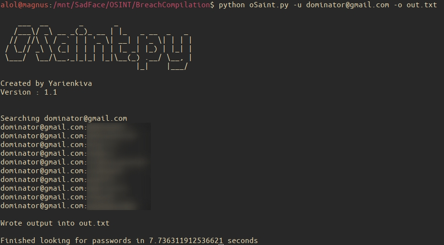
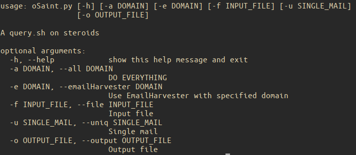

# oSaint : v1.1
The BreachCompilations query.sh on steroids (and python)

## how to use

Easy ! Download the password list (magnet link down below) using your prefered torrenting software then clone the repo `git clone https://github.com/yarienkiva/oSaint.git` and finally place the oSaint.py file in you data directory and run it.

## how does it work ?

Works exactly the same way query.sh works but uses python and has extra options implemented

## soon...
* a working theHarvester and compatibility with other OSINT tools
* a whole revamp to make this use a database (and enable a more precise and wider range of queries on emails and passwords)
* a tool to import the text BreachCompilation files and any other leaks (following the same syntax) into said database

magnet link : magnet:?xt=urn:btih:7ffbcd8cee06aba2ce6561688cf68ce2addca0a3&dn=BreachCompilation&tr=udp%3A%2F%2Ftracker.openbittorrent.com%3A80&tr=udp%3A%2F%2Ftracker.leechers-paradise.org%3A6969&tr=udp%3A%2F%2Ftracker.coppersurfer.tk%3A6969&tr=udp%3A%2F%2Fglotorrents.pw%3A6969&tr=udp%3A%2F%2Ftracker.opentrackr.org%3A1337

alternative : hXXp://pwndb2am4tzkvold[dot]onion, the original inspiration for this project. Only accessible through tor and is limited to 2000 tuples but uses an actual database (so wildcards can be used)
